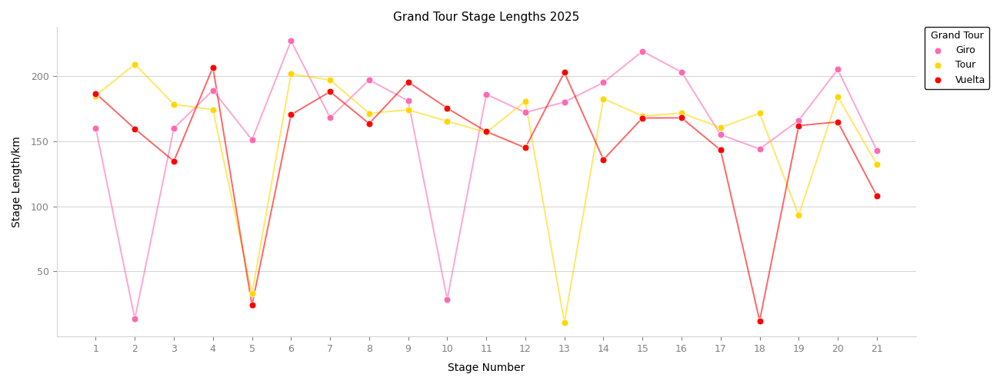

# GT_stage_analysis
This project aims to scrape, parse and then analyse the change in tactics, particularly focusing on the success rate of breakaways in the three cycling Grand Tours, the Giro d'Italia, Tour de France and Vuelta d'Espana. The website that is being used as the source of the data is procyclingstats.com.

## How to use:
The main.py file, located in the main file directory, can be used to selected which years would like to be scraped, and also whether and where the data should be saved to as a .json file. The next step in the main.py file enables selecting and loading of a .json file that has been previously saved by the program. It is also possible to use the single year plotting function to demonstrate that a single year of the scraped data has been sucessfully extracted by plotting the stage lengths of all three Grand Tours, as shown for 2025:
